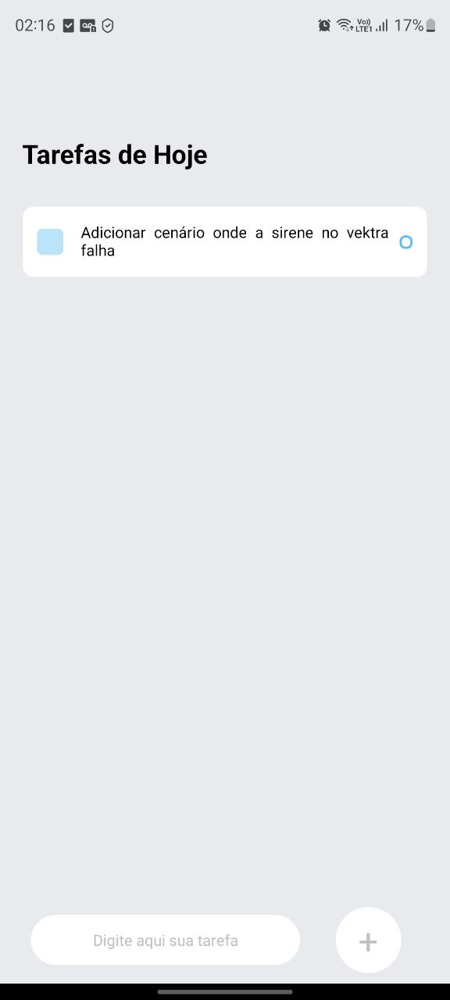
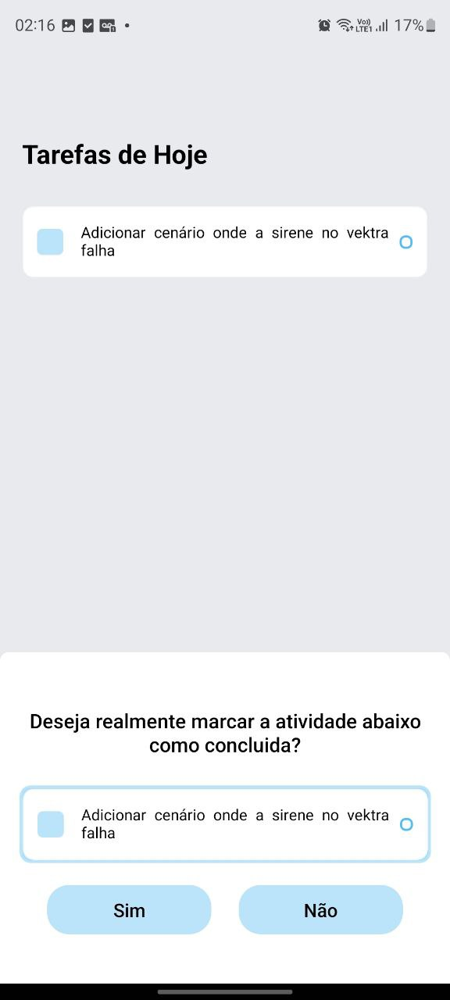
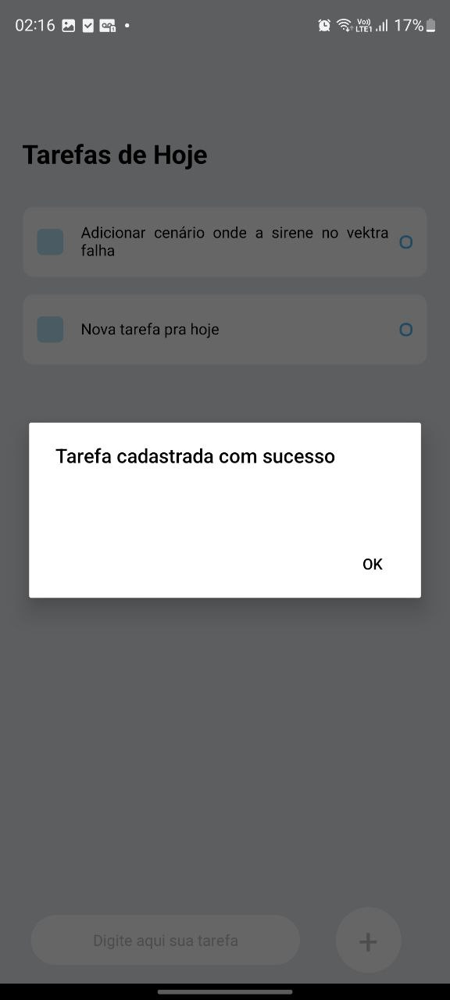

# Task List App
This is a simple task list application developed in React Native. It allows users to add, view, and remove tasks, with the ability to edit task details in a modal.

    
    
  

**Key Features**

Add a new task.
View the task list.
Remove tasks.
Local data persistence using AsyncStorage.
Prerequisites
Before getting started, make sure you have the React Native environment set up on your machine. You can follow the instructions in the official React Native documentation.

**Installation**

Clone the repository to your local machine.

Run:

npx react-native run-android

or

npx react-native run-ios

Explore the application's features, add new tasks, edit details, and mark tasks as completed.

**Contribution**

This is a simple project as I am learning React Native, so contributions are welcome! If you encounter any issues or have suggestions for improvement, feel free to open an issue or submit a pull request.

**License**
This project is licensed under the MIT License.
